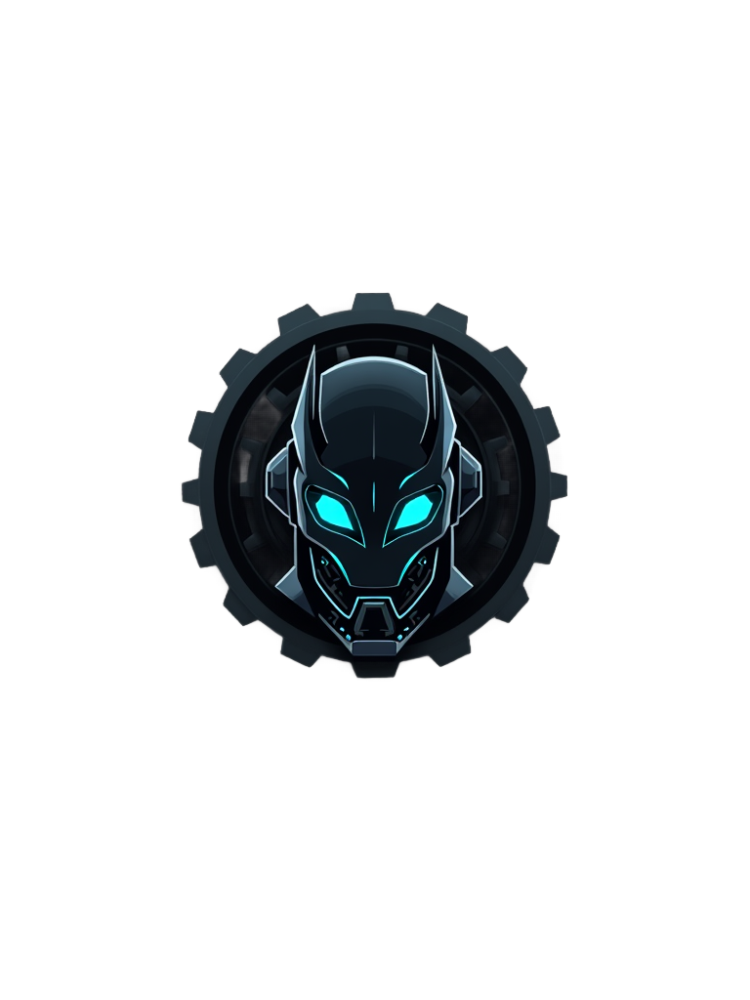

# Black Bot - Moderação de Comunidade do Discord  

## Descrição  
O Black Bot é uma solução eficaz para moderar e garantir a segurança da sua comunidade no Discord de forma fácil e rápida. Este bot implementa uma série de funcionalidades que ajudam a manter a ordem e a segurança do seu servidor.  

## Funcionalidades  
1. **Verificação CAPTCHA**: O bot cria um sistema de verificação CAPTCHA para novos membros, garantindo que apenas usuários humanos possam entrar na comunidade.  
2. **Banimentos Automáticos**: O Black Bot possui um sistema de banimento automático que detecta e remove links suspeitos enviados na comunidade.  
3. **Moderação Manual**: Os administradores têm acesso a um sistema que permite banimentos e aisos (silenciamentos) manuais, proporcionando controle total sobre a comunidade.  

## Como Usar  
- **Adicionar o Bot**: Clique no botão "Me adicione!" na página inicial para adicionar o Black Bot à sua comunidade do Discord.   

## Imagens  
-   
-   

## Contribuições  
Contribuições são bem-vindas! Se você deseja ajudar no desenvolvimento do Black Bot, sinta-se à vontade para abrir uma issue ou enviar um pull request.  

## Licença  
Este projeto é de código aberto, sinta-se à vontade para utilizá-lo e modificá-lo conforme suas necessidades.

## Link da Netlify

---  

Sinta-se à vontade para ajustar as seções conforme necessário e adicionar mais informações se desejar! Se precisar de mais alguma coisa, é só avisar.
